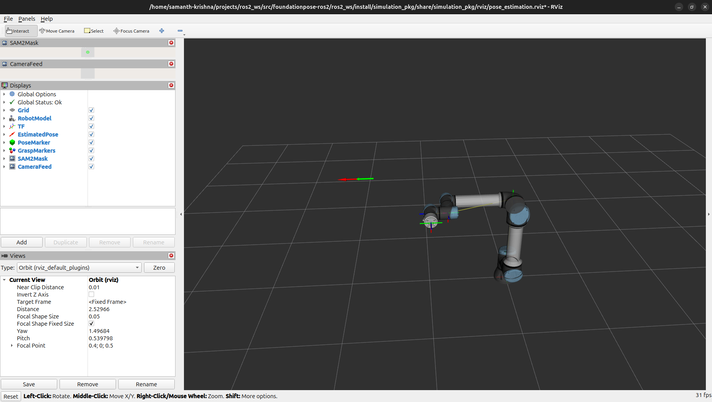

# 6-DoF Object Pose Estimation with FoundationPose + SAM2 (ROS2 Jazzy)

Most robot manipulation demos you see online rely on AprilTags little printed markers stuck to objects that tell the robot exactly where something is. That's fine for demos, but it doesn't work in the real world where objects don't come with stickers.

This project removes that dependency entirely. Point a depth camera at an object, give the system a 3D mesh of it, and it figures out the full 6-DoF pose position and orientation in 3D space without any markers, without retraining, without any setup per object.

The pipeline runs in ROS2 Jazzy with Gazebo simulation and feeds directly into MoveIt2 for robot grasping.


---

## What it does

An RGB-D camera feed goes through two stages. First, SAM2 (Meta's segment anything model) automatically segments the target object from the scene, no bounding box needed from the user. That mask gets handed to FoundationPose (NVIDIA, 2024), which estimates the full 6-DoF pose and publishes it as a `geometry_msgs/PoseStamped` on a ROS2 topic, transformed into the world frame via TF2.

The whole thing runs in Gazebo Harmonic so you don't need physical hardware to develop or test it.

---

*Figure: Complete visualization pipeline in RViz2 - showing the UR5e robot model, coordinate transforms (TF), estimated 6-DoF pose from FoundationPose, grasp markers, and SAM2 segmentation overlay*

## Why this matters

My earlier TIAGo pick-and-place project ([link](https://github.com/Sammykrishna/tiago-moveit2-pathplanning)) used AprilTags for object detection. It worked, but it's fundamentally limited, you need to know in advance which object you're grasping and stick a marker on it. Real industrial and humanoid robot applications don't have that luxury.

FoundationPose is zero-shot: you give it a mesh file once, and it can estimate the pose of that object in any scene, any lighting, any background. SAM2 handles the segmentation automatically so the pipeline requires zero human input at runtime.

---

## Current status

The full perception pipeline is working end to end in simulation:

- A simulated Intel RealSense D435i in Gazebo publishes synchronized RGB and depth streams.
- SAM2 automatically segments the target object every frame, no manual prompting beyond an initial point hint.
- FoundationPose initializes a 6-DoF pose estimate from the SAM2 mask and depth data, then tracks the object in real time once initialized.
- The estimated pose (in the camera's optical frame) is transformed into the world frame using a proper ROS2 TF2 tree (`world → camera_link → camera_optical`), rather than hand-rolled transform matrices, so the math follows standard ROS conventions (REP-103).
- The result is published as `/object_pose` and visualized live in RViz2 alongside the robot model, TF frames, and SAM2 mask overlay.
- Everything runs on a single consumer laptop GPU (RTX 4050, 6GB VRAM) — getting FoundationPose and SAM2 to coexist in that memory budget required running SAM2 on CPU, reducing FoundationPose's rotation candidate grid, running Gazebo headless, and tuning `PYTORCH_CUDA_ALLOC_CONF` for fragmentation.

Current pose accuracy is on the order of tens of centimeters at table scale, good enough to validate the full pipeline and proceed to grasp planning, with further calibration refinement planned alongside the MoveIt2 integration below.

---

## Stack

| Component | Tool | Version |
|-----------|------|---------|
| Robot middleware | ROS2 | Jazzy |
| Simulation | Gazebo Harmonic | — |
| Pose estimation | FoundationPose (NVIDIA) | 2024 |
| Segmentation | SAM2 (Meta) | 2024 |
| Motion planning | MoveIt2 | Jazzy |
| Language | Python | 3.10+ |
| Hardware req. | NVIDIA GPU | CUDA 12+ |

---

## Project structure

```
foundationpose-ros2/
├── ros2_ws/
│   └── src/
│       ├── simulation_pkg/
│       │   ├── worlds/                        # Gazebo world (table, camera, target object)
│       │   ├── launch/                        # Full pipeline launch file
│       │   └── rviz/                          # RViz2 config for visualization
│       └── pose_estimation_pkg/
│           ├── pose_estimation_pkg/
│           │   ├── foundationpose_node.py     # FoundationPose ROS2 wrapper
│           │   └── sam2_node.py               # SAM2 segmentation node
│           ├── config/
│           │   └── params.yaml                # Camera topics, thresholds, mesh paths
│           └── meshes/                        # YCB object mesh files (.obj)
├── FoundationPose/                             # NVlabs FoundationPose (submodule)
├── sam2/                                       # Meta SAM2 (submodule)
└── docs/
    └── media/                                  # Demo GIFs and screenshots
```

---

## Roadmap

- [x] Repository scaffold and project structure
- [x] Gazebo simulation with RGB-D camera (Intel RealSense D435i)
- [x] FoundationPose ROS2 node — subscribes to depth + color topics, publishes PoseStamped
- [x] SAM2 segmentation node — automatic object masking, no bounding box required
- [x] Full pipeline integration and visualization in RViz2
- [x] TF2-based camera-to-world pose transformation following REP-103 conventions
- [ ] **MoveIt2 grasp planning and execution** — using the live `/object_pose` estimate to plan a collision-free grasp with a UR5e, pick up the object, and place it at a target location
- [ ] Calibration refinement to tighten pose accuracy
- [ ] Benchmark on YCB-Video objects — reporting ADD (Average Distance) metric

### What's next

The perception side of the pipeline is complete and feeding real pose data into ROS2. The next phase is closing the loop on the manipulation side: taking the estimated `/object_pose`, planning a collision-free trajectory with MoveIt2 for a UR5e arm, executing the grasp, lifting the object, and placing it at a target location, all driven by the pose estimate rather than a hardcoded position.

---
## Getting started

### Requirements

- Ubuntu 24.04
- ROS2 Jazzy
- NVIDIA GPU with CUDA 12+
- Python 3.10+

### Build

```bash
git clone https://github.com/Sammykrishna/foundationpose-ros2.git
cd foundationpose-ros2/ros2_ws

colcon build
source install/setup.bash
```

Docker instructions will be added in the next commit once the simulation environment is set up.

---

## Background

This project is part of my M.Sc. Mechatronics studies at RWU Weingarten, building on earlier work in autonomous manipulation and sensor fusion. The goal is to get to a point where a robot arm can pick up an arbitrary object from a table, no markers, no object-specific training, purely from a depth camera and a mesh file.

---

## Author

**Samanth Krishna**
M.Sc. Mechatronics — Ravensburg-Weingarten University of Applied Sciences

[LinkedIn](https://linkedin.com/in/samanth-krishna-429126202) · [GitHub](https://github.com/Sammykrishna) · [Other projects](https://github.com/Sammykrishna?tab=repositories)