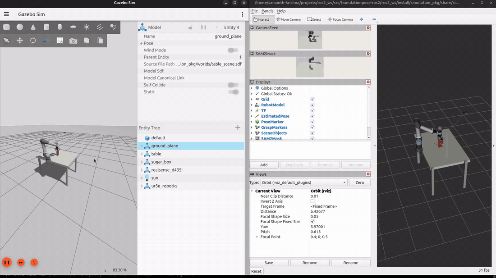
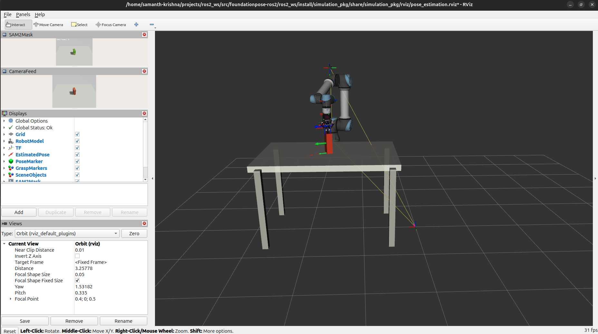
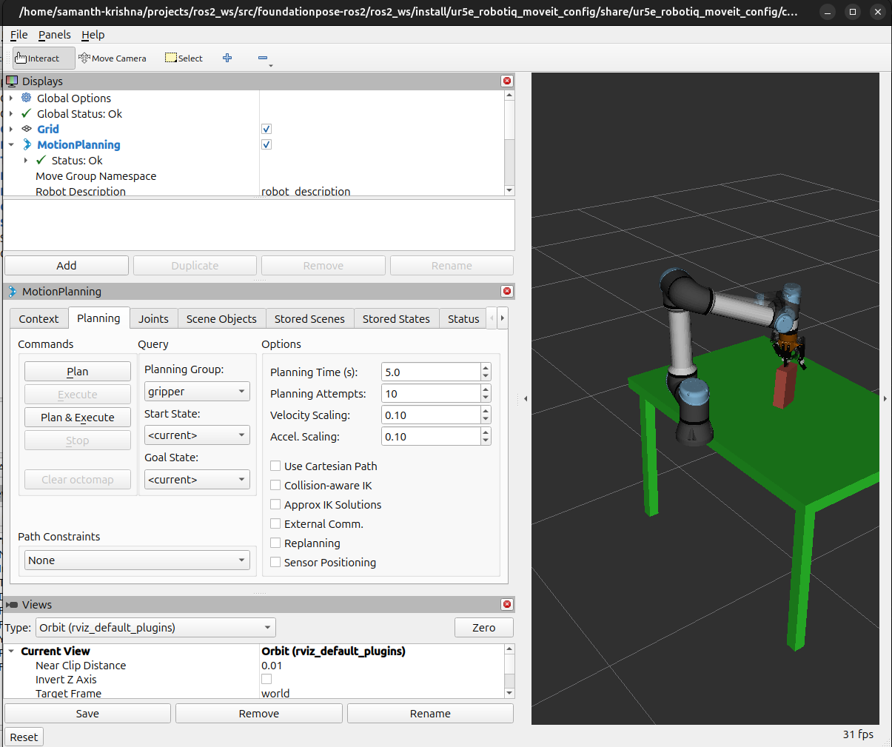

# 6-DoF Object Pose Estimation with FoundationPose + SAM2 (ROS2 Jazzy)

Most robot manipulation demos you see online rely on AprilTags, the little printed markers stuck to objects that tell the robot exactly where something is. That's fine for demos, but it doesn't work in the real world where objects don't come with stickers.

This project removes that dependency entirely. Point a depth camera at an object, give the system a 3D mesh of it, and it figures out the full 6-DoF pose (position and orientation in 3D space) with no markers, no retraining, and no per-object setup. That pose estimate then drives a UR5e arm through MoveIt2 to actually pick the object up.

The pipeline runs in ROS2 Jazzy with Gazebo simulation, and it's now closed end to end: camera in, robot picking things up out.


---

## What it does

An RGB-D camera feed goes through two stages. First, SAM2 (Meta's segment anything model) automatically segments the target object from the scene, no bounding box needed from the user. That mask gets handed to FoundationPose (NVIDIA, 2024), which estimates the full 6-DoF pose and publishes it as a `geometry_msgs/PoseStamped` on a ROS2 topic, transformed into the world frame via TF2.

That pose feeds straight into MoveIt2, which plans a collision-free path to the object, closes a Robotiq 2F-85 gripper around it, lifts it, and returns to a safe home position, all without a hardcoded coordinate anywhere in the loop.

The whole thing runs in Gazebo Harmonic so you don't need physical hardware to develop or test it.

---

*Figure: One full run on real Gazebo physics, driven by live SAM2 + FoundationPose output: Gazebo (left) and RViz2 (right). The gripper closes with a real contact stall, and the box physically leaves the table and is carried home. Full-quality version: [`docs/media/gazebo-rviz-pick-and-lift.mp4`](docs/media/gazebo-rviz-pick-and-lift.mp4).*


*Figure: Complete visualization pipeline in RViz2, showing the UR5e robot model, coordinate transforms (TF), estimated 6-DoF pose from FoundationPose, grasp markers, and SAM2 segmentation overlay*

## Why this matters

My earlier TIAGo pick-and-place project ([link](https://github.com/Sammykrishna/tiago-moveit2-pathplanning)) used AprilTags for object detection. It worked, but it's fundamentally limited: you need to know in advance which object you're grasping and stick a marker on it. Real industrial and humanoid robot applications don't have that luxury.

FoundationPose is zero-shot. You give it a mesh file once, and it can estimate the pose of that object in any scene, any lighting, any background. SAM2 handles the segmentation automatically so the pipeline requires zero human input at runtime.

---

## Current status

The full pipeline works end to end in simulation, from camera pixels to a completed pick-and-place cycle.

**Perception:**
- A simulated Intel RealSense D435i in Gazebo publishes synchronized RGB and depth streams.
- SAM2 automatically segments the target object every frame, with just an initial point hint, no manual bounding box.
- FoundationPose initializes a 6-DoF pose estimate from the SAM2 mask and depth data, then tracks the object in real time once initialized. Initialization now waits for a real SAM2 mask instead of falling back to a coarse depth-threshold heuristic, which used to cause the node to lock onto a stable but wrong pose without any obvious error.
- The estimated pose (in the camera's optical frame) gets transformed into the world frame using a proper ROS2 TF2 tree (`world -> camera_link -> camera_optical`) instead of hand-rolled transform matrices, so the math follows standard ROS conventions (REP-103).
- Position accuracy is around 2.5mm on X/Y against known ground truth. There's a small, fully explained offset on Z: the mesh's local origin sits at the object's bottom face rather than its center, so the raw pose describes where the bottom of the box touches the table. The manipulation side corrects for this (see below).
- The scene geometry matches physical reality. The table is a tabletop slab on four legs rather than a solid block down to the floor, and the robot base sits at table height beside the table edge, both necessary fixes since a solid-block table leaves no room for the arm and a floor-mounted base can't reach a tabletop object.
- Everything runs on a single consumer laptop GPU (RTX 4050, 6GB VRAM). Getting FoundationPose and SAM2 to fit in that memory budget together meant running SAM2 on CPU, shrinking FoundationPose's rotation candidate grid, running Gazebo headless for the perception-only runs, and tuning `PYTORCH_CUDA_ALLOC_CONF` to reduce fragmentation.

**Manipulation:**
- A Robotiq 2F-85 gripper is mounted on the UR5e via a proper adapter plate, with a dedicated TCP frame that already accounts for the gripper's physical reach so the perception team's raw pose doesn't need any manual offset tweaking downstream.
- A live MoveIt2 planning scene tracks both the table and the object as real collision geometry, updated from `/object_pose` in real time, not a fixed scene authored by hand.
- The grasp orientation is computed automatically from the object's estimated yaw, aligning the gripper's jaw axis with the object's shorter side. The target box's long side is within 2mm of the gripper's maximum opening, so getting this right isn't optional, a naive fixed approach angle would fail depending on how the object happened to be rotated on the table.
- The bottom-to-center correction mentioned above (perception reports the object's bottom face, not its center) is implemented as a single shared utility, used identically by both the planning scene's collision geometry and the grasp pose computation, so there's one source of truth instead of two numbers that could quietly drift apart.
- The full sequence (home, open gripper, approach, descend, close gripper, attach object, lift, return home, release) has been verified working end to end using live, camera-derived poses, not just hand-typed test coordinates.
- Attach/detach was previously unverified past "should work per the AttachedCollisionObject message pattern." It's now checked programmatically against MoveIt2's own planning scene (`/get_planning_scene`, not eyeballing RViz's Scene Objects panel) across a batch of automated trials: `sugar_box` moves cleanly from the world collision objects into the robot's attached objects on grasp and back on release, with zero duplication observed. That check also caught a real bug: if a step after attach failed (e.g. lift planning), the box stayed attached in MoveIt while `planning_scene_manager`'s error-state handling resumed publishing it as a world object too, so it would exist in both lists at once. Fixed by detaching before reporting the terminal error, and caught live by the same trial batch (see `manipulation_trial_runner`).
- Ran 15 automated trials with randomized, kinematically-reachable box positions and yaws (synthetic `/object_pose`, manipulation loop only): 8/15 (53%) completed the full pick-lift-return cycle. All 7 failures were OMPL planning failures for the pre-grasp approach (one for the post-grasp lift), not attach/detach or gripper issues, consistent with the planner-robustness gap below.
- Also ran the true end-to-end version: same trial harness in a passive mode that publishes nothing, letting SAM2 + FoundationPose drive the grasp entirely from the live Gazebo camera feed. 6 trials, 5/6 (83%) success, 0/6 attach/detach duplications. The camera-observed box pose was essentially identical across trials (arm motion here uses fake hardware, so it never actually displaces the real Gazebo object), so this run validates that the full perception-to-grasp pipeline is wired correctly and repeatable at one real, camera-derived pose; it's the synthetic-pose run above that stresses planner reliability across the workspace. The one failure was the same category as before: an OMPL pre-grasp planning failure.

---

## Results at a glance

| Area | Status | Detail |
|---|---|---|
| Perception accuracy (X/Y) | Done | ~2.5 mm against known ground truth |
| Zero-shot pose estimation | Done | No markers, no per-object training, mesh file only |
| GPU memory footprint | Done | Fits comfortably in 6 GB (RTX 4050 Mobile) |
| Live scene understanding for planning | Done | Table and object tracked as real MoveIt2 collision geometry, updated from perception in real time |
| Orientation-aware grasp planning | Done | Gripper jaw automatically aligned to the object's shorter axis from its estimated yaw |
| Full pick, lift, and return cycle | Done | 8/15 (53%) over randomized reachable poses (synthetic); 5/6 (83%) true end-to-end with real SAM2 + FoundationPose driving the grasp from the live camera feed |
| Attach/detach correctness | Done | Verified programmatically against MoveIt2's planning scene across all 21 trials (both runs above): 0 duplications, box always ends back in the world list. Caught and fixed a real post-failure duplication bug in the process |
| Planner robustness | In progress | Every recorded failure across both trial batches was an OMPL planning failure (mostly pre-grasp, one lift), never attach/detach or gripper issues |
| Physics-based grasping (Gazebo contact, not MoveIt bookkeeping) | Working, not yet reliable | Real Gazebo dynamics via `gz_ros2_control`. The gripper closes with a real `stalled: True` contact signal and the box is physically lifted and carried home (checked against Gazebo's own box pose, z 0.84 -> ~1.72 m). With live SAM2 + FoundationPose driving it: 3 clean lifts in 4 runs after the fixes below; the fourth gripped but the lift plan aborted on a start-state contact check. Too few runs for a success rate. See below |
| Effort-based gripper with real stall detection | Done | Direct-effort controller reporting a genuine sensor-derived `stalled` flag. The grasp sequence now aborts when a close does not stall, instead of attaching and "lifting" nothing (it used to report DONE with the box untouched on the table) |
| Grasp descent accuracy under physics | In progress | Pre-grasp lands within ~1 mm, but the final descent stalls 30-80 mm short of target (`shoulder_lift` and `wrist_1` lag by 0.05-0.12 rad), so the grip lands on the upper part of the box. Grip still works; root cause not yet found |
| Placing at an arbitrary target location | Not yet | Currently returns to and releases at a fixed home pose |
| Formal benchmark (YCB-Video, ADD metric) | Not yet | Planned |

A real pose sample from a live run, straight off `/object_pose`:

```
position:  x = 0.797,  y = 0.016,  z = 0.752
```

That Z value lands within about 2mm of the table's known surface height (0.750m), which is exactly what you'd expect for a box resting on the table with a small amount of physics-engine settling. It's a nice sanity check that the whole chain, camera through to a real-world-shaped number, is behaving.

---

## Manipulation in action


*Figure: The UR5e approaching the object mid-sequence, viewed through the perception pipeline's own RViz2 window (SAM2 mask and camera feed panels on the left).*


*Figure: The same moment viewed through MoveIt2's RViz2 instance, showing the MotionPlanning panel and the live planning scene the pose estimate feeds into.*

---

## Verifying the manipulation loop

`manipulation_trial_runner` (in `robot_control_pkg`) drives the grasp executor through N randomized, reachable box poses and checks the result against MoveIt2's own planning scene rather than reading RViz by eye:

```bash
ros2 launch ur5e_robotiq_moveit_config demo.launch.py use_rviz:=false
ros2 run robot_control_pkg planning_scene_manager
ros2 run robot_control_pkg grasp_executor
ros2 run robot_control_pkg manipulation_trial_runner --ros-args -p num_trials:=15
```

Each trial publishes a synthetic `/object_pose`, waits for the grasp sequence to reach `DONE`/`ERROR`, and polls `/get_planning_scene` to confirm `sugar_box` never appears in both the world and attached object lists at once. It writes a per-trial breakdown and summary to `report_path` (default `/tmp/manipulation_trial_report.txt`). Latest run: 15 trials, 8/15 (53%) full-cycle success, 0 attach/detach duplications.

Pass `-p passive_mode:=true` instead to get a true end-to-end number: the runner publishes nothing and just waits for SAM2 + FoundationPose to drive the grasp from the real Gazebo camera feed, applying the same `/get_planning_scene` check.

```bash
ros2 launch simulation_pkg gazebo.launch.py standalone:=false
ros2 launch ur5e_robotiq_moveit_config demo.launch.py use_rviz:=false
ros2 run robot_control_pkg planning_scene_manager
ros2 run robot_control_pkg grasp_executor
ros2 run robot_control_pkg manipulation_trial_runner --ros-args -p passive_mode:=true -p num_trials:=6
```

Latest run: 6 trials, 5/6 (83%) full-cycle success, 0 attach/detach duplications, driven entirely by real perception.

---

## Physics-based grasping: real contact instead of MoveIt bookkeeping

Everything above runs on `use_fake_hardware:=true`: the arm and gripper snap instantly to commanded joint positions with no dynamics, so "attach" was always MoveIt's planning scene deciding the object was held, never an actual physical grip. `gazebo_physics_bringup.launch.py` (in `robot_control_pkg`) spawns the real robot into Gazebo and actuates it through the `gz_ros2_control` plugin instead, so the gripper has to make real contact:

```bash
ros2 launch robot_control_pkg gazebo_physics_bringup.launch.py use_rviz:=true perception:=true
ros2 run robot_control_pkg planning_scene_manager --ros-args -p use_sim_time:=true
ros2 run robot_control_pkg grasp_executor --ros-args -p sim_gazebo:=true -p use_sim_time:=true -p single_shot:=true
```

`perception:=true` also starts SAM2 and FoundationPose, the `/clock` and camera bridges, and the camera TFs, so this one launch replaces `gazebo.launch.py` for physics runs (leave it off to publish a synthetic `/object_pose` instead). `single_shot:=true` makes the executor stop after one attempt; without it the executor re-arms as soon as perception publishes another stable pose.

Getting a heavy 6-DOF arm to just *hold still* under gravity in `gz_ros2_control` took several fixes, none of them documented anywhere obvious enough to find quickly:

- **Physics engine**: `dartsim` (gz sim's default) can't build collision shapes from mesh geometry at all ("Mesh construction ... not implemented for dartsim"), silently dropping every mesh-based collision on this robot. Switching to `bullet-featherstone` fixes mesh collision but has known, tracked feature gaps in joint velocity/motor support (`gazebosim/gz-physics#545`, `#1087`, `gazebosim/gz-sim#2729`) — commands were accepted and controllers reported "Goal successfully reached!" while the real simulated joint barely moved. Stayed on `dartsim` for reliable actuation and instead gave just the two fingertip links (the only ones that need to touch the box) primitive box collision, sized from the real collision STL's measured bounding box. The arm's own mesh collisions stay dropped under `dartsim` — that's fine, since MoveIt's own (mesh-capable) collision checking is what actually keeps the arm off the table, not Gazebo's.
- **Joint damping**: `ur_description` hardcodes `damping="0" friction="0"` on every arm joint with no xacro argument to override it. Combined with `gz_ros2_control`'s position-servo having no derivative term, that's an undamped spring against gravity — the arm oscillated indefinitely instead of settling. Patched in real damping (5.0) on the generated URDF text before publishing it.
- **`position_proportional_gain` syntax**: this is a direct child element of `<hardware>` (`<position_proportional_gain>5.0</position_proportional_gain>`), not a `<param name="...">` the way `mock_components/GenericSystem` reads its config. Using `<param>` was silently ignored — every gain value tried, including absurdly large ones (10000, 100000), produced identical behavior, because the plugin was always falling back to its own default regardless.
- **It's a velocity servo, not a torque PID**: `joint_velocity = gain * position_error * update_rate`. Gains in the thousands saturate the velocity limit on any nonzero error, which looks like "holding" but is actually a standing bang-bang command — it settled into a wrong, table-colliding pose. A modest gain (5.0 for the arm, 50.0 for the gripper, which needs real squeeze authority against an obstruction) tracks smoothly instead.
- **Spawn pose**: a Gazebo-spawned joint's real physical angle is 0 regardless of what `ros2_control`'s declared `initial_value` claims. Without a Gazebo-native `<axis><initial_position>` override on `shoulder_lift_joint`, the arm spawned fully extended and had to be servoed all the way to the SRDF "home" pose after activation — a multi-second free-fall/uncontrolled window that left it in a different, table-colliding pose every time regardless of gain. Spawning already at home sidesteps that entirely.
- **Controller activation timing**: tightened the spawn → controller-activation gap from ~6s to well under 1s, removing another window where the arm could drift uncommanded before anything was holding it.
- **Floating-point bounds rejection**: under real physics, the gripper's knuckle joint reports a tiny signed residual (~1e-13) when resting at its declared 0.0 lower limit — not a real position, just simulation noise. MoveIt's `CheckStartStateBounds` adapter has no tolerance for this at all (confirmed in its source: it only normalizes continuous-joint angle wrapping, never fixes a bounded position violation, however tiny) and aborted every plan touching the gripper. Fixed via `joint_limits.yaml`, which lets MoveIt's planning model override the URDF's declared position limits without touching the hardware limit itself.

With all of that fixed, the arm holds a commanded pose to ~1e-13 rad of drift under gravity. But the gripper *action itself* turned out to never actually reach the hardware, through a chain of three more bugs that all produced the exact same symptom — the sequence logged "Opening/Closing gripper..." and moved straight on with no error, `execute()`'s own return value silently ignored by the existing code:

- **`joint_states` runs on sim time, MoveIt's node doesn't**: `gz_ros2_control` stamps `/joint_states` with Gazebo's simulation clock, not wall time. `trajectory_execution_manager`'s pre-execution "is this state fresh" check compares its own wall-clock request time against that sim-time stamp — always stale, by roughly the process's entire wall-clock age. For `FollowJointTrajectory` (the arm) that's just a WARN and execution proceeds anyway; `GripperCommand`'s controller handle treats it as fatal and the goal is never sent at all. This is a confirmed, currently-unresolved upstream `moveit_py` limitation (`moveit/moveit2#2906`, closed "not planned") — not something fixable by config alone.
- **The real fix: bypass MoveIt for the gripper.** A parallel-jaw open/close doesn't need collision-aware motion planning — it's a single-joint move to a known target. `grasp_executor` now calls the `control_msgs/action/GripperCommand` action server directly with a plain `rclpy.action.ActionClient` when `sim_gazebo:=true`, skipping MoveIt's controller-manager dispatch (and the clock bug) entirely.
- **That introduced a classic `MutuallyExclusiveCallbackGroup` deadlock**: the 1 Hz `grasp_timer` callback blocks (via `threading.Event`, not `rclpy.spin_until_future_complete` — that helper's own `add_node()`/`remove_node()` bookkeeping deadlocked against a `MultiThreadedExecutor` already spinning the same node) waiting for the action client's response. Both landed in the node's default callback group, so the response callback could never run while the timer callback — the thing waiting for it — held that group's one execution slot. Reproduced and confirmed in a from-scratch isolated script before fixing it: giving the timer and the action client a shared `ReentrantCallbackGroup` lets them interleave.
- **A long-lived `gripper_effort_controller` process degraded**: after ~20 minutes and many earlier client-side timeouts (from the two bugs above), the controller node itself stopped completing new goals even though a fresh restart of the exact same node worked instantly. Root cause not fully isolated — likely orphaned per-goal execution state accumulating under the `ReentrantCallbackGroup` — but restarting it periodically during heavy testing is a known-working mitigation.

With the deadlock and clock-dispatch bugs fixed, gripper open/close dispatched and completed reliably, but nine trials in a row closed on nothing (`stalled: False`, box height unchanged). That was first blamed on arm positioning accuracy. The real causes were a mix of simulation and code problems, found one at a time:

- **False success**: `_attach_box()` is pure MoveIt planning-scene bookkeeping (it publishes an `AttachedCollisionObject`, nothing physical), and the sequence carried on after a close with `stalled: False`, so it reported `DONE` with the box untouched on the table (confirmed against Gazebo's own box pose). Closing without a stall now fails the sequence.
- **Stall detection**: the stall check needed an unbroken 0.3 s of near-zero velocity, and contact jitter kept resetting that timer, so the close could time out short of target with `stalled: False`. A close that ends well short of the fully-closed position is now treated as contact.
- **Passive finger linkage**: dartsim does not enforce the URDF `<mimic>` tags, so the right knuckle and both fingertips hung under gravity. Measured at the open pose, the right fingertip sat about 4-9 cm out of place, dragging its collision pad into the box. Fixed by driving both knuckles with effort (the right one sign-mirrored), holding a small opening torque at rest so the fingers stay against their open stop, making the fingertip joints rigid, and moving the pad collision boxes onto the rigid finger links.
- **Stale world state**: after many failed attempts the box had been nudged ~14 cm off while `grasp_executor` kept using a cached `/object_pose`, so some "misses" were aimed at the wrong place. Reset the box (`gz service .../set_pose`) between diagnostic runs.
- **Arm accuracy was partly real**: `moveit_py`'s `execute()` also silently no-op'd arm trajectories under the sim-time clock mismatch, so arm goals now go straight to the `FollowJointTrajectory` action server (planning still uses MoveIt/OMPL). A pre-execution forward-kinematics check proved planning always hits the goal to <1 mm; a settle wait polls real joint velocities, and one corrective re-plan runs if the arm settles more than 1 cm off.
- **Invisible arm in Gazebo**: the UR5e visuals use `package://` URIs Gazebo can't resolve, so only the gripper rendered. The launch file now rewrites them to absolute paths.
- **Depth camera blinded by the arm**: with the arm really in the scene, the original camera position (0.8, -0.5, 1.45) sat inside the arm's envelope at home, and the depth image came back as `-inf` almost everywhere while RGB looked fine, so FoundationPose's `register()` reported "valid too small". The camera is now mirrored to the far side of the table at (0.8, +0.5, 1.45), yaw -90°, with the world SDF, both launch files' TF and the RViz marker updated to match.
- **180° yaw ambiguity**: FoundationPose reported the box yaw as -158.8° against a true +17.2°, and OMPL could not plan that orientation from home. The gripper is symmetric under a 180° turn, so the grasp yaw is folded into (-90°, 90°].
- **Test-harness hygiene**: earlier restarts left orphaned FoundationPose processes running, which dragged the simulation to ~0.4x real time and caused arm-trajectory timeouts. Wall-clock timeouts were also loosened for slow runs.

**Result**: with these fixed, the gripper closes with `stalled: True` (about 0.32-0.35 rad, i.e. genuinely stopped on the box) and the box is physically carried to the home pose. Driven by live SAM2 + FoundationPose: 3 clean lifts in 4 runs; the other gripped the box but the lift plan aborted on a `CheckStartStateCollision` contact and the sequence reported failure. That is far too few runs for a success rate.

**Still open**: the final descent stalls 30-80 mm short of the target, with `shoulder_lift` (0.05-0.12 rad) and `wrist_1` lagging while the other joints hit target exactly and repeatably. The fingers still straddle the box, so the grip works but lands on its upper part. Cause not yet found.

---

## A few bugs along the way

Worth mentioning since they're the kind of thing that can bite anyone building a ROS2 plus simulation plus ML pipeline:

- A race condition where FoundationPose could initialize from a crude fallback mask if SAM2 hadn't published its first real segmentation yet. The resulting pose looked stable frame to frame, since tracking just refines from wherever it started, while actually being wrong the whole time. That made it look like a coordinate frame bug for a long time before the real cause turned up.
- Two different nodes were both publishing `world -> base_link` on `/tf_static`, our own static transform and one hardcoded inside the UR5e's stock URDF, so TF was flip-flopping between two different robot positions depending on which message arrived last. The same category of bug reappeared later when integrating the perception launch file with MoveIt2's own launch file, both starting a `robot_state_publisher` and `joint_state` source, and was fixed the same way: pick one authority, gate the other off.
- A 2x scale mismatch between the object mesh and its Gazebo collision geometry.
- A packaged gripper hardware macro that gave every mimic joint (the ones mechanically slaved to the gripper's main actuated joint) its own command interface, which `ros2_control`'s resource manager flatly refuses. Fixed by writing a minimal three-line hardware block that only claims the one real actuated joint.
- The gripper's touch links weren't fully enumerated for collision allowance during a grasp: it turned out the knuckle links, not just the fingers, are the ones that actually contact the object, found by reading the real error message closely rather than guessing.
- Attach/detach state could desync between MoveIt and `planning_scene_manager`: the latter infers "is the box attached" purely from the `/grasp_status` string, not from whether `_attach_box()` actually ran. A planning failure between attach and detach (e.g. the lift step) left the box attached in MoveIt while the resulting error status made `planning_scene_manager` resume publishing it as a world object too, duplicating it. Caught by an automated trial (a real lift-planning failure, not a contrived one) and fixed by detaching before reporting the terminal error.

---

## Stack

| Component | Tool | Version |
|-----------|------|---------|
| Robot middleware | ROS2 | Jazzy |
| Simulation | Gazebo Harmonic | - |
| Pose estimation | FoundationPose (NVIDIA) | 2024 |
| Segmentation | SAM2 (Meta) | 2024 |
| Motion planning | MoveIt2 | Jazzy |
| End effector | Robotiq 2F-85 | - |
| Language | Python | 3.10+ |
| Hardware req. | NVIDIA GPU | CUDA 12+ |

---

## Project structure

```
foundationpose-ros2/
├── ros2_ws/
│   └── src/
│       ├── simulation_pkg/
│       │   ├── worlds/                        # Gazebo world (table, camera, target object)
│       │   ├── launch/                        # Full pipeline launch file
│       │   └── rviz/                          # RViz2 config for visualization
│       ├── pose_estimation_pkg/
│       │   ├── pose_estimation_pkg/
│       │   │   ├── foundationpose_node.py     # FoundationPose ROS2 wrapper
│       │   │   └── sam2_node.py               # SAM2 segmentation node
│       │   ├── config/
│       │   │   └── params.yaml                # Camera topics, thresholds, mesh paths
│       │   └── meshes/                        # YCB object mesh files (.obj)
│       ├── robot_control_pkg/
│       │   ├── urdf/                          # UR5e + Robotiq 2F-85 wrapper xacro
│       │   ├── launch/                        # gazebo_physics_bringup.launch.py (physics + optional perception)
│       │   ├── config/                        # ros2_controllers.yaml for gz_ros2_control
│       │   └── robot_control_pkg/             # Grasp executor, gripper effort controller, planning scene manager, trial runner, geometry utils
│       └── ur5e_robotiq_moveit_config/         # Generated MoveIt2 config (SRDF, controllers, kinematics)
├── FoundationPose/                             # NVlabs FoundationPose (submodule)
├── sam2/                                       # Meta SAM2 (submodule)
└── docs/
    └── media/                                  # Demo GIFs and screenshots
```

---

## Roadmap

- [x] Repository scaffold and project structure
- [x] Gazebo simulation with RGB-D camera (Intel RealSense D435i)
- [x] FoundationPose ROS2 node, subscribes to depth + color topics, publishes PoseStamped
- [x] SAM2 segmentation node, automatic object masking, no bounding box required
- [x] Full pipeline integration and visualization in RViz2
- [x] TF2-based camera-to-world pose transformation following REP-103 conventions
- [x] Calibration refinement: mesh/collision scale matched, SAM2 initialization race fixed, millimeter-level X/Y accuracy achieved
- [x] Scene geometry made physically realistic: tabletop on legs, reachable robot base placement
- [x] Robotiq 2F-85 gripper integrated with a dedicated TCP frame
- [x] Live MoveIt2 planning scene driven by the perception pipeline's object pose
- [x] Orientation-aware grasp planning, no hardcoded approach angle
- [x] Full pick, lift, and return-home cycle verified on live camera-derived poses
- [x] Attach/detach verified programmatically against MoveIt2's planning scene, and a real duplication bug fixed, across an automated multi-trial success-rate measurement (`manipulation_trial_runner`)
- [x] Real Gazebo-physics actuation via `gz_ros2_control` (`gazebo_physics_bringup.launch.py`): arm holds a commanded pose to ~1e-13 rad under gravity, full grasp sequence executes end to end on real dynamics instead of instant fake actuation
- [x] Effort-based gripper control with real closed-loop stall detection, bypassing a confirmed-unresolved upstream `moveit_py`/sim-time bug (`moveit/moveit2#2906`) and a `MutuallyExclusiveCallbackGroup` deadlock along the way; the gripper now reports a genuine sensor-derived `stalled` flag instead of MoveIt bookkeeping alone
- [x] Physical grasp and lift on real Gazebo dynamics: root causes fixed (false-success bookkeeping, stall detection, passive finger linkage, camera-in-arm depth failure, pose yaw ambiguity), box lifted and carried home from live SAM2 + FoundationPose poses (`docs/media/gazebo-rviz-pick-and-lift.gif`)
- [ ] Measure a real success rate for the physics-mode pipeline (so far only a handful of runs)
- [ ] Fix the grasp descent stopping 30-80 mm short (`shoulder_lift` / `wrist_1` lag), so the grip lands at the box's true center
- [ ] Fix the occasional lift-plan abort on a start-state contact check after a successful grip
- [ ] Tune planner reliability so grasp poses solve consistently on the first attempt
- [ ] Place the object at an arbitrary target location instead of releasing at home
- [ ] Benchmark on YCB-Video objects, reporting ADD (Average Distance) metric

### What's next

The physics-mode pipeline now works end to end in a small number of runs, so the priorities are reliability and accuracy rather than getting a grasp at all: (1) a proper batch of physics-mode runs to get a real success rate, (2) the descent that stalls 30-80 mm short at the grasp pose, and (3) the lift-plan start-state contact abort seen once after a good grip. Layered on top: the planner-robustness issue from the fake-hardware trials, placing the object somewhere other than back at home, and a benchmark against YCB-Video to put a real number on pose accuracy across a range of objects.

---
## Getting started

### Requirements

- Ubuntu 24.04
- ROS2 Jazzy
- NVIDIA GPU with CUDA 12+
- Python 3.10+

### Build

```bash
git clone https://github.com/Sammykrishna/foundationpose-ros2.git
cd foundationpose-ros2/ros2_ws

colcon build
source install/setup.bash
```

Docker instructions will be added in the next commit once the simulation environment is set up.

---

## Background

This project is part of my M.Sc. Mechatronics studies at RWU Weingarten, building on earlier work in autonomous manipulation and sensor fusion. The goal is a robot arm that can pick up an arbitrary object from a table, no markers, no object-specific training, purely from a depth camera and a mesh file, and that goal is now demonstrated end to end in simulation.

---

## Author

**Samanth Krishna**
M.Sc. Mechatronics, Ravensburg-Weingarten University of Applied Sciences

[LinkedIn](https://linkedin.com/in/samanth-krishna-429126202) · [GitHub](https://github.com/Sammykrishna) · [Other projects](https://github.com/Sammykrishna?tab=repositories)