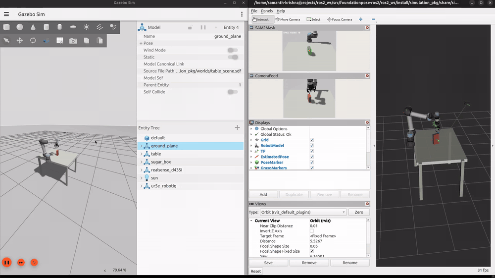
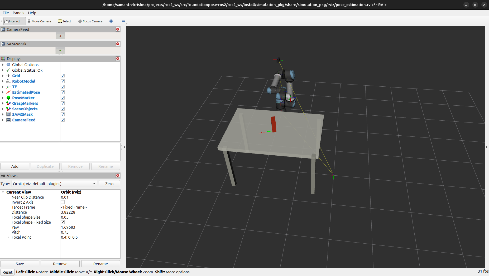

# A Robot Arm That Finds and Moves Objects With No Markers (ROS2 Jazzy)

Most robot demos you see online use AprilTags, little printed markers stuck on every object so the robot knows where it is. That works in a lab, but real objects don't come with stickers.

This project drops the markers completely. A depth camera looks at the table, a segmentation model (SAM2) picks the object out of the picture, and a pose model (FoundationPose) works out exactly where it sits in 3D and how it is turned. A UR5e arm with a Robotiq gripper then uses that answer to pick the object up, carry it somewhere else and put it down. Everything runs in simulation with ROS2 Jazzy, Gazebo and MoveIt2.




*One full run, sped up. Gazebo is on the left and RViz on the right. The arm picks the sugar box, lifts it well off the table and sets it down at a random spot. Then the camera finds it again on its own, and the arm picks it up a second time and puts it back where it started. In RViz the box turns green while the gripper is holding it. A slower version is in [`docs/media/pick-place-return-mission.mp4`](docs/media/pick-place-return-mission.mp4).*

---

## What it does

1. **See.** A simulated RealSense camera watches the table. SAM2 outlines the object, and FoundationPose turns that outline plus the depth image into a 3D position and orientation. It only needs a 3D model of the object once, with no marker and no training.
2. **Plan.** MoveIt2 works out a collision-free path. The gripper turns to line up with the short side of the box, because the long side is almost as wide as the gripper can open.
3. **Grab.** The gripper closes with a controlled squeeze and feels for the object, so "grasped" means it really touched something, not just that a motion finished.
4. **Move and look again.** The arm lifts, carries and places the box, then backs away so the camera can look again. That second look is what lets the robot pick the box up from its new spot.

The last step is the point of the demo. The second pick uses a position that came only from the camera, so it shows that the vision and the robot really are talking to each other.



*RViz during a run: the robot model, the estimated pose of the box, the grasp markers and the SAM2 outline.*

---

## How well it works right now

The demo works from start to finish, but it is not reliable yet.

| What | Where it stands |
|---|---|
| Finding the box | Usually within 2 to 3 cm of the truth, with the right orientation. It gets noisier right after the box has been moved. |
| Picking it up | The gripper reaches the middle of the box, squeezes and holds it without slipping. |
| Lift and carry | The box is lifted about 30 cm and carried to a random spot on the table. |
| Putting it back | In the recorded run the box ended up about 2 cm from where it started. |
| Reliability | In my last three recorded attempts, one finished the whole demo. The other two got stuck on the second pick because the motion planner could not find a path. |

Earlier tests with an instant, non-physical robot (no real contact) finished the pick and lift in 5 of 6 camera-driven trials. Those numbers can't be compared with the current ones, because real physics is much harder than a robot that snaps straight to its target.

---

## Running it

You will need Ubuntu 24.04, ROS2 Jazzy and an NVIDIA GPU. It runs on a laptop RTX 4050 with 6 GB of memory.

```bash
git clone https://github.com/Sammykrishna/foundationpose-ros2.git
cd foundationpose-ros2/ros2_ws
colcon build
source install/setup.bash

ros2 launch robot_control_pkg gazebo_physics_bringup.launch.py use_rviz:=true perception:=true mission:=true
```

That opens Gazebo and RViz, starts the camera, SAM2 and FoundationPose, and runs the whole pick, place and return demo once. Leave off `mission:=true` if you only want the scene and the perception running.

---

## Things I ran into

A few problems took real digging, and they might save someone else some time.

- **The fingers would not reach the box.** The arm always stopped about 8 cm above where it should. I added contact sensors to the box and found that the gripper's own collision shapes were getting in the way: the little linkage parts hung down and rested on the box. Keeping only the two fingertip pads fixed it.
- **The box slipped while being carried.** The pads tilted as the gripper closed and only touched the box on an edge. Turning them to sit flat at the closing angle, and raising the friction, stopped the slipping and the tilted drops that came from it.
- **The camera could not see through the arm.** Once the arm was really in the scene, the original camera position was almost inside it, and the depth image came back empty. Moving the camera to the far side of the table fixed it.
- **Success was reported too early.** The old code said "grasped" whenever the gripper finished closing, even on empty air. Now a grasp only counts when the fingers actually stop against something.
- **RViz showed a frozen box.** The box in RViz was a fixed marker. It now follows the real box and changes color while it is being held.

---

## What is in the repo

```
foundationpose-ros2/
├── ros2_ws/src/
│   ├── simulation_pkg/               Gazebo world, camera and RViz setup
│   ├── pose_estimation_pkg/          SAM2 and FoundationPose nodes
│   ├── robot_control_pkg/            Grasp logic, gripper control, launch files
│   └── ur5e_robotiq_moveit_config/   Robot setup for MoveIt2
├── FoundationPose/                   NVIDIA's pose model (submodule)
├── sam2/                             Meta's segmentation model (submodule)
└── docs/media/                       Screenshots and demo videos
```

---

## Where it is heading

- [x] Camera, SAM2 and FoundationPose working together in Gazebo
- [x] A UR5e with a gripper that plans around the table and the object
- [x] Real physics grasping with a gripper that feels the object
- [x] Pick, lift, carry and place, with the camera finding the box again for a second pick
- [ ] Make the second pick reliable, since the planner still gives up now and then
- [ ] Measure a proper success rate over many runs
- [ ] Place more accurately than the current 2 to 4 cm
- [ ] Try more objects and report a standard accuracy score (YCB-Video)

---

## Background

This is part of my M.Sc. Mechatronics studies at RWU Weingarten. It builds on my earlier TIAGo pick-and-place project ([link](https://github.com/Sammykrishna/tiago-moveit2-pathplanning)), which used AprilTags. The goal here is a robot that can pick up an object it has never seen before, using nothing but a depth camera and a 3D model.

**Samanth Krishna**
M.Sc. Mechatronics, Ravensburg-Weingarten University of Applied Sciences

[LinkedIn](https://linkedin.com/in/samanth-krishna-429126202) · [GitHub](https://github.com/Sammykrishna) · [Other projects](https://github.com/Sammykrishna?tab=repositories)
